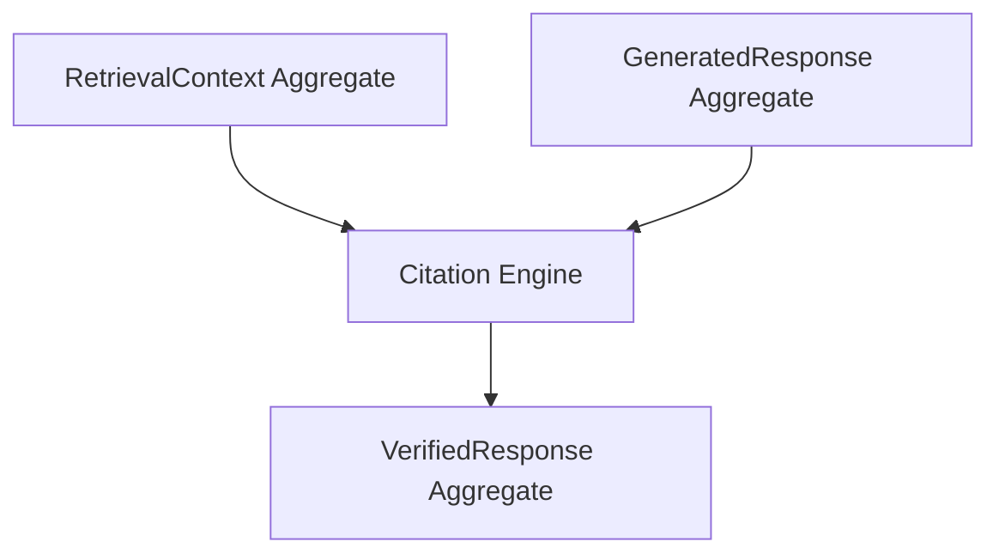

# System Architecture

> "The application follows a layered Clean Architecture structure in which every component has a single responsibility. Information flows through a deterministic pipeline coordinated by Application Services and executed by core Domain Engines, ensuring inward-facing dependencies and infrastructure independence."

---

# 1. Architectural Goals

The architecture of Libris is designed around the following objectives:

- **Inward Dependency Direction**: Higher-level policy layers (Domain and Application) never depend on lower-level detail layers (Presentation and Infrastructure).
- **Clear Separation of Concerns**: Core business logic remains isolated from frameworks, storage schemas, language model APIs, and user interfaces.
- **Engine-Based Domain Model**: Self-contained domain capabilities (Engines) represent specific business processes with well-defined inputs and outputs.
- **Local-First Execution**: The design prioritizes processing textbooks, embeddings, and indices locally to enforce user privacy, ownership, and offline usability.
- **Strict Determinism**: Processing pipelines are designed to yield reproducible outcomes under identical configuration, which is critical for system evaluation and testing.
- **Provider Independence**: Infrastructure Providers can be replaced with minimal impact on domain logic, as Engines remain provider-independent.

---

# 2. High-Level Architecture

The system implements a classic four-layer Clean Architecture. Dependencies point strictly inward:

`Presentation Layer -> Application Layer -> Domain Layer <- Infrastructure Layer`

### Concentric Layers
```
┌─────────────────────────────────────────────────────────┐
│                  INFRASTRUCTURE LAYER                   │
│    ┌───────────────────────────────────────────────┐    │
│    │              PRESENTATION LAYER               │    │
│    │    ┌─────────────────────────────────────┐    │    │
│    │    │          APPLICATION LAYER          │    │    │
│    │    │    ┌───────────────────────────┐    │    │    │
│    │    │    │       DOMAIN LAYER        │    │    │    │
│    │    │    │                           │    │    │    │
│    │    │    │       Core Engines &      │    │    │    │
│    │    │    │       Domain Entities     │    │    │    │
│    │    │    │                           │    │    │    │
│    │    │    └───────────────────────────┘    │    │    │
│    │    │                                     │    │    │
│    │    │   Application Workflows & Services  │    │    │
│    │    │                                     │    │    │
│    │    └─────────────────────────────────────┘    │    │
│    │                                               │    │
│    │          UI Views, CLI, Controllers           │    │
│    └───────────────────────────────────────────────┘    │
│                                                         │
│     ChromaDBProvider / PyPDFProvider / GeminiProvider   │
└─────────────────────────────────────────────────────────┘
```

### Flow of Control and Dependency Direction
```
[ Presentation Layer ] (Web UI, CLI, API Controllers)
         │
         ▼
[ Application Layer ]  (Ingestion & Query Application Services)
         │
         ▼
[    Domain Layer    ]  (Document, Chunking, Embedding, Indexing,
         ▲              Retrieval, Grounding, Generation, Citation Engines)
         │ (Implements Domain Interfaces)
[ Infrastructure Layer ] (Infrastructure Providers: ChromaDB, PyPDF, Gemini)
```

---

# 3. Layer Overview

| Layer | Responsibility | Components |
|---|---|---|
| **1. Presentation** | Render user interfaces, capture user inputs, and present outputs. | Web UI Dashboard, Library Manager, Query Workspace, CLI, API Controllers. |
| **2. Application** | Coordinate use case workflows, handle validation boundaries, manage execution flow. | `IngestionApplicationService`, `QueryApplicationService`, validation objects, error handlers. |
| **3. Domain** | Contain the core business rules and logic of the platform. | The 8 core Engines (Document, Chunking, Embedding, Indexing, Retrieval, Grounding, Generation, Citation) and Domain Entities. |
| **4. Infrastructure** | Implement domain interfaces, integrate third-party libraries, storage indexes, and external APIs. | `PyPDFProvider`, `ChromaDBProvider`, `SentenceTransformerProvider`, `GeminiProvider`, `LocalFileStorageProvider`. |

---

# 4. Presentation Layer

The Presentation Layer acts as the entry point for user interaction. It captures user inputs (such as uploading a PDF or typing a query) and translates them into calls to the Application Layer.

### Components
- **Dashboard**: High-level system overview showing indexed books, total pages, chunks, and system health.
- **Library View**: Interactive catalog for adding, listing, and removing textbooks.
- **Query Workspace**: Academic interface with a question input field, generated answer panel, and citation panel.
- **Evidence Explorer**: Dedicated diagnostic panel displaying retrieved chunks, similarity ranks, and source metadata.
- **Settings UI**: Interface to configure system parameters like chunk size, overlap, retrieval limit, and model selection.
- **System Status View**: Component reporting the health status of individual domain engines and infrastructure providers.

---

# 5. Application Layer

The Application Layer is the orchestration hub of the platform. It houses **Application Services** which define the steps for each user workflow. It does not perform actual text processing, vector math, or prompt construction; instead, it coordinates the appropriate Domain Engines and Infrastructure Providers to achieve the use case.

### Key Application Services
- **IngestionApplicationService**: Coordinates the step-by-step ingestion and indexing of a textbook.
- **QueryApplicationService**: Coordinates query processing, retrieval, prompting, generation, and citation.

### Core Responsibilities
- Coordinating multi-engine business workflows.
- Handling request validation and mapping incoming requests to Domain objects.
- Handling infrastructure exceptions and mapping them to clean, user-friendly error models.
- Managing execution sequences and saving transaction results.

---

# 6. Domain Layer

The Domain Layer is the heart of the application. It defines the business rules, data structures (Domain Entities), and the Engine Catalogue that manipulates them. It depends on no external packages, frameworks, or layers.

### The 8 Domain Engines
1. **Document Engine**: Validates the source PDF structure and parses it into hierarchical entities (`Book`, `Chapter`, `Section`, `Page`).
2. **Chunking Engine**: Segments extracted `Page` text into cohesive semantic `Chunks` while maintaining context continuity.
3. **Embedding Engine**: Converts raw text strings (`Chunk` or `Query`) into numerical vector representations (`Embedding` or `Query Embedding`).
4. **Indexing Engine**: Manages the loading, persistence, and rebuilding of chunk vectors and metadata into the `Knowledge Index`.
5. **Retrieval Engine**: Performs similarity searches on the index, filters candidates based on thresholds, and ranks them to output a structured `Retrieval Context`.
6. **Grounding Engine**: Assembles the `Retrieval Context` and the original `Query` into a typed, structured `Prompt` object enforcing knowledge boundaries.
7. **Generation Engine**: Manages language model interactions, submitting the prompt to produce a raw response string.
8. **Citation Engine**: Validates references, extracts supporting excerpts, and formats the raw text and citations into a final, verified response.

---

# 7. Infrastructure Layer

The Infrastructure Layer contains concrete implementations (Providers) of the interfaces defined in the Domain and Application layers. It is the outer ring of Clean Architecture and adapts third-party libraries and databases to fit the system.

### Infrastructure Providers
- **PyPDFProvider**: Implements document parsing using libraries like `PyPDF` to convert documents to text.
- **ChromaDBProvider**: Implements the `Knowledge Index` storage, indexing, and similarity queries using `ChromaDB`.
- **SentenceTransformerProvider**: Generates vector representations using local libraries like `Sentence Transformers`.
- **GeminiProvider**: Calls API clients (local or hosted) to run inference on structured prompts using the Gemini language model.
- **LocalFileStorageProvider**: Manages physical file read/write operations on the local file system.

---

# 8. Storage Architecture

The Storage Layer is managed as an infrastructure concern, implementing repository interfaces defined by the Domain Layer.

```
               [ Domain Layer: Interfaces ]
                            ▲
                            │ (Implemented by)
         [ Infrastructure Layer: Providers ]
               │            │            │
               ▼            ▼            ▼
        LocalFileStorage   ChromaDBProvider  ConfigProvider
        (Original PDFs)    (Knowledge Index) (Local JSON/INI)
```

- **LocalFileStorageProvider**: Persists original textbook PDFs and raw page-level extracted text on the local filesystem.
- **ChromaDBProvider**: Persists semantic embeddings and metadata in the Knowledge Index, optimizing it for similarity lookup.
- **ConfigProvider**: Persists system and engine configurations in local JSON or INI format.

---

# 9. End-to-End Workflows

Workflows are coordinated by the Application Layer and executed sequentially by Domain Engines, which utilize Infrastructure Providers.

### A. Textbook Ingestion Workflow
```
[ Presentation Layer ] (Select PDF -> Click Upload)
         │
         ▼
[ IngestionApplicationService ] (Application Service orchestrates)
         │
         ├──► 1. Document Engine ──► [ PyPDFProvider ] ─────────► Output: Book & Pages
         ├──► 2. Chunking Engine ──────────────────────────────► Output: Chunks
         ├──► 3. Embedding Engine ─► [ SentenceTransformerProvider ] ──► Output: Embeddings
         └──► 4. Indexing Engine ──► [ ChromaDBProvider ] ─────► Output: Rebuilt Knowledge Index
```

### B. Query and Reference Workflow
```
[ Presentation Layer ] (Type Question -> Click Submit)
         │
         ▼
[ QueryApplicationService ] (Application Service orchestrates)
         │
         ├──► 1. Embedding Engine ─► [ SentenceTransformerProvider ] ──► Output: Query Embedding
         ├──► 2. Retrieval Engine ──► [ ChromaDBProvider ] ─────► Output: Retrieval Context
         ├──► 3. Grounding Engine ─────────────────────────────► Output: Prompt
         ├──► 4. Generation Engine ─► [ GeminiProvider ] ────────► Output: Raw Response
         └──► 5. Citation Engine ──────────────────────────────► Output: Generated Response
```

---

# 10. Architectural Interaction Patterns

### The Aggregate Merge Pattern
While most domain engines in the pipeline behave as pure transformers (taking a single aggregate and converting it into a single downstream aggregate, e.g., `RetrievalContext -> Prompt -> GeneratedResponse`), the **Citation Engine** acts as a reconciler:



This pattern brings the two parallel streams of execution (the raw evidence captured in the `RetrievalContext` and the inferred answer generated in `GeneratedResponse`) back together. By reconciling the evidence references against the response, it constructs a unified `VerifiedResponse` aggregate containing supporting citations and excerpts verified to map exactly to source chunks without altering the generated answer text.

---

# 11. Dependency Direction Rules

To ensure long-term testability and maintainability, the codebase enforces strict boundaries:

1. **Inward Dependencies**: Code within the Domain Layer must never import classes or utilities from Application, Presentation, or Infrastructure.
2. **Abstractions First**: If the Domain Layer requires database storage or external APIs, it defines an interface. The Infrastructure Layer imports the Domain Layer and implements that interface (Dependency Inversion).
3. **No Direct UI-to-Engine Access**: The Presentation Layer must only interact with Application Services. It is prohibited from calling individual Engines directly.
4. **Data Transfer Objects (DTOs)**: Communication between the Presentation Layer and Application Layer uses simple DTO schemas to prevent leakage of domain internals.

---

# 12. Architectural Principles

Every module and file in the system must conform to these software engineering principles:

- **Single Responsibility Principle (SRP)**: Each class or module has one reason to change.
- **Loose Coupling**: Inter-module communication occurs via defined interfaces and simple domain models.
- **High Cohesion**: Business logic that belongs to a single domain capability resides together within its designated Engine.
- **Pluggability / Replaceability**: Replacing an embedding model or index provider is done by writing a new Infrastructure provider without touching the core retrieval flow.
- **Pipeline Determinism**: Given identical inputs and parameters, ingestion and retrieval stages must behave deterministically.
- **Explainability**: Every response remains traceable from the final text back through the Grounding, Retrieval, and Ingestion stages to the source textbook page.

---

# Architecture Summary

The architecture of Libris is built around a single unifying vision:

> Preserving the integrity of self-learning requires a reference assistant that is trustworthy. Trust is achieved by organizing code into clean layers, isolating business engines, executing processing pipelines deterministically, and enforcing strict boundaries so that every generated statement is grounded in verifiable evidence.

Every component, interface, and model in the system operates to fulfill this design standard.