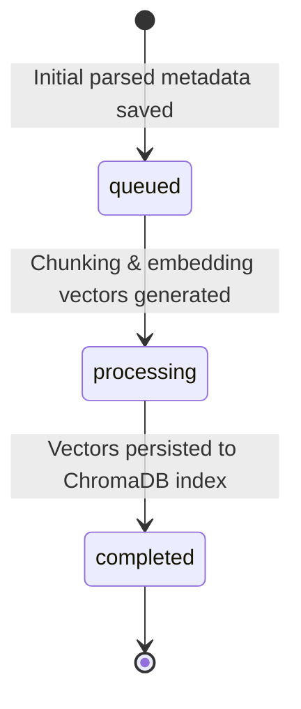

# Developer Reference & Codebase Guide

This document provides a comprehensive technical overview of Libris’s architecture, domain boundaries, state management, and design patterns.

---

## 1. Clean Architecture Model

The platform strictly adheres to **Clean Architecture** principles to separate business rules from technical details (UI, database, LLM providers). 

```text
    ┌──────────────────────────────────────────────┐
    │                Presentation                  │  <-- REST Controllers (FastAPI) / React Web App
    └──────────────────────┬───────────────────────┘
                           │
    ┌──────────────────────▼───────────────────────┐
    │                Application                   │  <-- Orchestrators, DTOs, Use Cases
    └──────────────────────┬───────────────────────┘
                           │
    ┌──────────────────────▼───────────────────────┐
    │                  Domain                      │  <-- Core Entities, Engines, Value Objects
    └──────────────────────▲───────────────────────┘
                           │
    ┌──────────────────────┴───────────────────────┐
    │                Infrastructure                │  <-- Database Adapters, Gemini API, PyPDF
    └──────────────────────────────────────────────┘
```

### Dependency Rules
*   **Domain**: The innermost layer. It has zero external dependencies and does not know about databases, servers, or APIs. It contains pure business logic.
*   **Application**: Coordinates use cases by invoking domain engines. It communicates with outer layers using Interfaces (Contracts) and Data Transfer Objects (DTOs).
*   **Infrastructure**: Implements interfaces defined by the domain or application layer (e.g. database saving, PDF parsing, embedding calculation).
*   **Presentation**: Exposes FastAPI REST endpoints and consumes DTO payloads.

---

## 2. Domain Engine Responsibilities

The platform splits pipeline functions into single-purpose **Domain Engines**:

*   **Document Engine**: Responsible for parsing native PDFs, extracting hierarchical outlines, and returning a structured `Document` aggregate.
*   **Chunking Engine**: Segments page texts into semantic blocks with predefined overlaps to preserve semantic continuity during vector retrieval.
*   **Embedding Engine**: Maps text chunks into vector representations using SentenceTransformer embeddings.
*   **Indexing Engine**: Persists chunks and vectors into ChromaDB for high-dimensional search.
*   **Retrieval Engine**: Executes similarity query searches across ChromaDB.
*   **Grounding Engine**: Compiles context packages, ensuring LLM prompt models do not hallucinate outside retrieved evidence boundaries.
*   **Generation Engine**: Coordinates prompt execution against LLM interfaces to produce synthesized answers.
*   **Citation Engine**: Verifies generated claims against chunk texts, creating citation footnotes linking to precise pages.

---

## 3. Aggregate Lifecycle & State Management

### The `Book` Aggregate Root
A `Book` acts as the Aggregate Root for the ingestion sub-domain. Its state transitions through the following phases:



To ensure consistency:
1.  The `Book` aggregate is initially persisted in SQL/NoSQL metadata storage with status `queued`.
2.  Once all pages are chunked, embedded, and successfully committed to ChromaDB, the application service updates the status to `completed` and saves it.

---

## 4. Dependency Injection & Provider Abstraction

We decouple physical services (like Gemini API or ChromaDB) from domain models using the **Dependency Inversion Principle (DIP)**.

### Provider Abstraction
We define abstract base classes (interfaces) in `src/domain/interfaces/` or `src/application/contracts/`. For example, `LanguageModelProvider` is defined as:

```python
class LanguageModelProvider(ABC):
    @abstractmethod
    def invoke(self, prompt: str, system_instruction: str | None = None) -> str:
        pass
```

The concrete class `GeminiProvider` resides in `src/infrastructure/providers/language_model/` and inherits from it.

### Dependency Injection
Dependencies are injected during application startup (see `backend/src/presentation/api/dependencies.py`). FastAPI endpoints receive fully initialized application service instances through dependency injection, preventing hardcoded constructors:

```python
def get_query_service(
    book_repo: BookRepository = Depends(get_book_repository),
    db_provider: VectorDbProvider = Depends(get_vector_db_provider),
) -> QueryApplicationService:
    # Factory constructs and returns the service instance
    ...
```

---

## 5. Coding & Naming Conventions

Maintain consistency when adding new components:
*   **Entities**: Noun-based naming (e.g. `Book`, `Page`, `Chunk`). Must inherit from `Entity[IdType]` base.
*   **Value Objects**: Immutable attributes (e.g. `BookId`, `QueryId`). Must inherit from `ValueObject`.
*   **Engines**: Suffix with `Engine` (e.g. `DefaultCitationEngine`).
*   **DTOs**: Suffix with `Request` or `Response` or `Dto` (e.g. `IngestDocumentRequest`).
*   **Repositories**: Interface suffixed with `Repository` (e.g. `BookRepository`).
*   **Providers**: Infrastructure services suffixed with `Provider` (e.g. `ChromaVectorDbProvider`).

---

## 6. Testing Philosophy

We enforce strict test boundaries to maintain code reliability:

*   **Unit Tests (`backend/tests/`)**:
    *   Test domain logic and application services in isolation.
    *   Infrastructure dependencies (like databases or third-party APIs) **must be mocked** using `unittest.mock` to ensure tests run offline in milliseconds.
*   **Integration Tests**:
    *   Test correct wiring between infrastructure adapters and engines.
*   **Vitest Frontend Tests (`frontend/src/`)**:
    *   Verify presentation components in isolation using standard React Testing Library hooks.

---

## 7. Extending the Platform: Adding a New LLM Provider

To swap Google Gemini with a different provider (e.g., Anthropic Claude):

1.  **Create the Provider Class**:
    In `backend/src/infrastructure/providers/language_model/claude.py`, implement `LanguageModelProvider`:
    ```python
    from src.application.contracts.providers import LanguageModelProvider

    class ClaudeProvider(LanguageModelProvider):
        def __init__(self, api_key: str):
            self.api_key = api_key

        def invoke(self, prompt: str, system_instruction: str | None = None) -> str:
            # Implement Claude API call logic here
            return "Claude response"
    ```
2.  **Register the Provider**:
    Update the dependency factory in `backend/src/presentation/api/dependencies.py` to instantiate `ClaudeProvider` instead of `GeminiProvider`:
    ```python
    @lru_cache
    def get_llm_provider() -> LanguageModelProvider:
        api_key = os.getenv("CLAUDE_API_KEY", "")
        return ClaudeProvider(api_key=api_key)
    ```
3.  **Update Environment**:
    Add `CLAUDE_API_KEY` to the `.env` configuration file.
