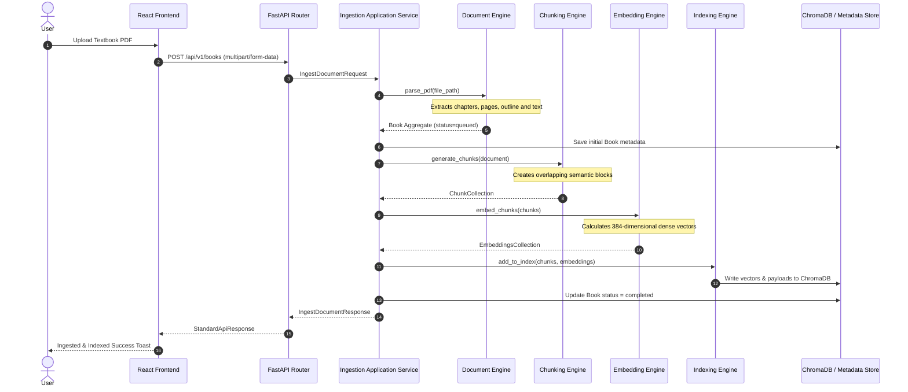
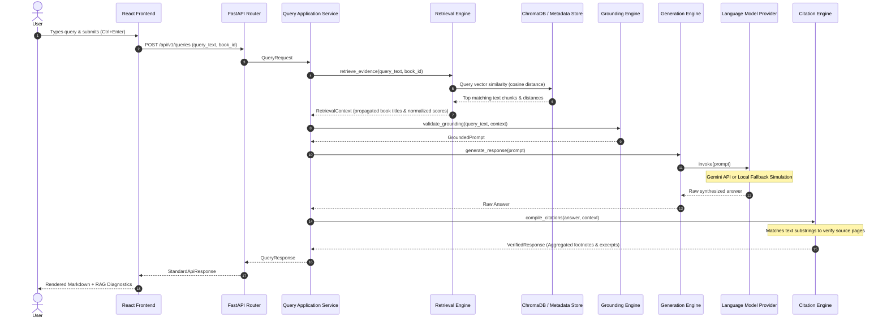

# System Architecture & Pipeline Walkthrough

This document provides a detailed step-by-step walkthrough of Libris’s two primary execution pipelines: **Textbook Ingestion** and **RAG Query Retrieval**.

---

## 1. Textbook Ingestion Pipeline

The textbook ingestion pipeline transforms a raw PDF document into a structured outline and a set of vector-indexed semantic chunks.

### Ingestion Flow Diagram

### Stage-by-Stage Breakdown

1.  **User Upload**: The user selects a native PDF file in the UI Library and uploads it.
2.  **API Schema Validation**: FastAPI validates the incoming file format and routes it to the `IngestionApplicationService`.
3.  **Document Engine**: The engine uses `PyPDFProvider` to read the physical PDF. It extracts the table of contents (outline) and maps every word/paragraph to its respective chapter, section, and page number, constructing a hierarchical `Book` domain entity aggregate with `status="queued"`.
4.  **Initial Metadata Save**: The parsed book metadata (author, title, pages) is saved to the local store so it immediately appears in the library.
5.  **Chunking Engine**: The engine processes the book text page-by-page, grouping sentences into chunks (e.g. 500 characters) with sliding windows (e.g. 100 characters overlap) to prevent losing context across chunk boundaries.
6.  **Embedding Engine**: Each text chunk is passed to the `SentenceTransformerProvider`, which converts the textual representations into 384-dimensional mathematical vectors using the `all-MiniLM-L6-v2` model.
7.  **Indexing Engine**: The indexer stores these vectors and their corresponding textual payloads and metadata (page number, chapter ID, section ID) inside ChromaDB.
8.  **Status Completion**: Once ChromaDB confirms writing is done, the book status is marked as `completed` and saved in the repository.

---

## 2. RAG Query Retrieval Pipeline

The query pipeline executes vector similarity searches on user questions, enforces grounding guardrails, invokes the LLM, and verifies citations.

### Query Flow Diagram

### Stage-by-Stage Breakdown

1.  **Query Input**: The user enters a question in the query form (optionally specifying a particular textbook to scope the search).
2.  **Retrieval Engine**:
    *   Converts the question into a 384-dimensional query vector.
    *   Queries ChromaDB using cosine distance to retrieve the top `N` (e.g. 4) most relevant chunks.
    *   Resolves the actual book title from the metadata storage to replace placeholder IDs.
    *   Transforms raw vector distances into normalized similarity scores: `similarity_score = 1.0 - distance`.
3.  **Grounding Engine**: Inspects the retrieved chunks. If the similarity score of the best chunk falls below the threshold, it prevents sending queries to the LLM to avoid hallucinations. It constructs a system prompt enclosing the exact retrieved text blocks as the *only* source of truth.
4.  **Generation Engine**: Invokes the `LanguageModelProvider` (Google Gemini). If the API key is missing or fails, the provider runs its intelligent fallback simulation to generate the grounded response. It marks the metadata source as `"Gemini"` or `"Local Simulation"`.
5.  **Citation Engine**: Scans the raw answer text for citations (e.g., `[1]`, `[2]`). It maps each citation index back to the exact chunk text, cross-references that the facts actually match the source chunk, and builds verification aggregates.
6.  **Response Delivery**: The verified answer, source metadata, similarity metrics, and citation ranges are returned as a standard JSON payload. The React UI parses this payload, highlights search terms, renders bulleted list structures, and provides clickable citation indicators.
