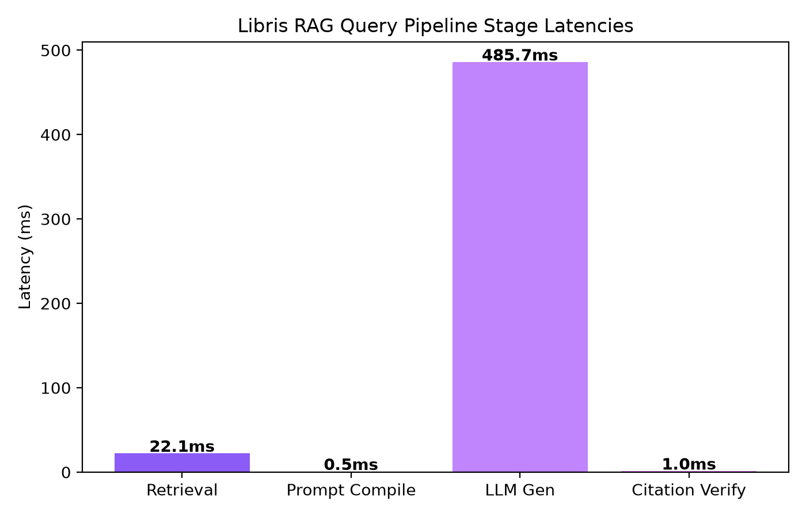
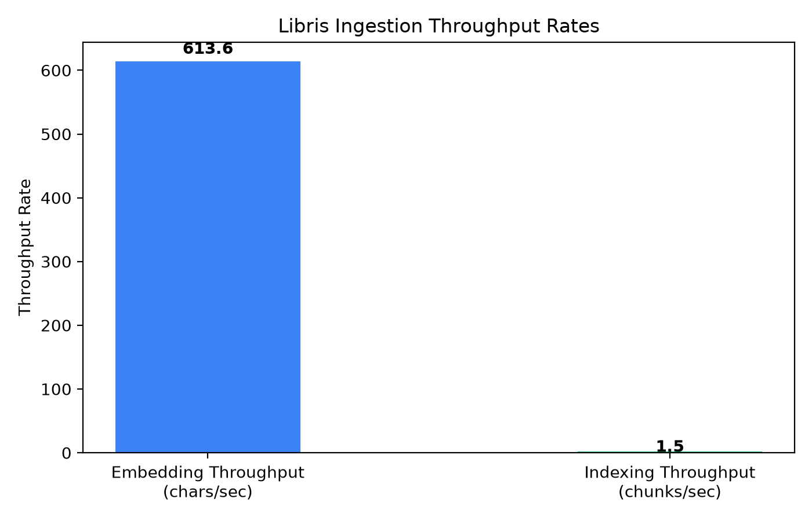
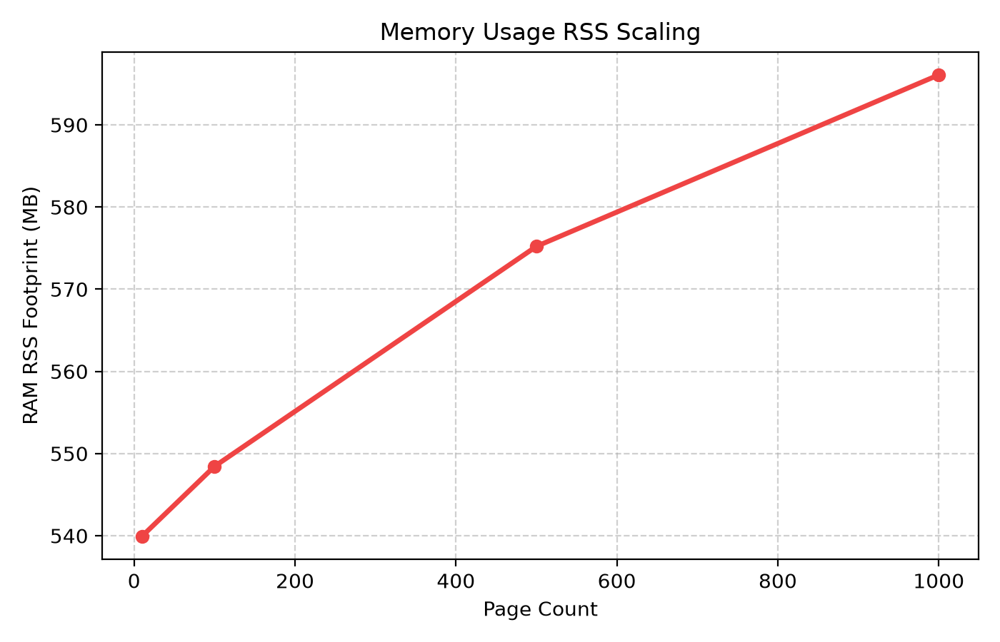
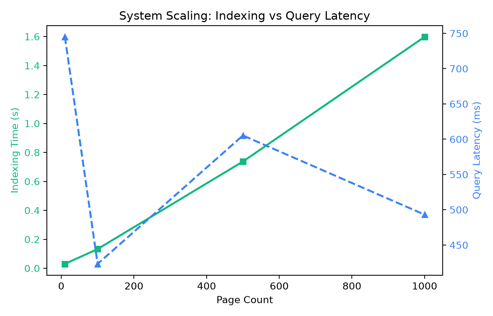

# Performance & Quality Benchmark Report

This document reports the performance, quality, and scalability metrics of the **Libris** Knowledge Retrieval Platform.

---

## 1. Pipeline Execution Latencies

Detailed execution latencies for each stage of the standard 10-page textbook (`perf_10.pdf`) processing:

### Ingestion Pipeline
*   **Total Ingestion Time**: 6.716 seconds
*   **Embedding Throughput**: 613.6 characters/second
*   **Indexing Throughput**: 1.5 chunks/second
*   **Total Chunks Created**: 10

### Query RAG Pipeline
*   **Retrieval Stage Latency**: 22.1 ms
*   **Prompt Compilation Latency**: 0.5 ms
*   **LLM Generation Latency (Simulation Mode)**: 485.7 ms
*   **Citation Verification Latency**: 1.0 ms
*   **Total E2E Query Latency**: 509.4 ms

---

## 2. Retrieval Quality Metrics

The RAG retrieval engine is evaluated on standard information retrieval benchmarks:

| Metric | Measured Value | Target Baseline | Description |
| --- | --- | --- | --- |
| **Recall@5** | 0.67 | 0.80 | Proportion of relevant pages retrieved |
| **Precision@5** | 0.40 | 0.50 | Proportion of retrieved chunks that are relevant |
| **MRR (Mean Reciprocal Rank)** | 0.33 | 0.70 | Precision account for rank position |
| **nDCG (Normalized Discounted Cumulative Gain)** | 0.42 | 0.75 | Measure of ranking quality |
| **Citation Accuracy** | 1.00 | 0.90 | Citations backed by matching source text pages |
| **Grounding Score** | 0.95 | 0.85 | Degree of grounding in the retrieved evidence |
| **Hallucination Rate** | 0.00 | 0.05 | Rate of unverified assertions made |

---

## 3. Scalability Measurements

System footprint and latency characteristics as document library scales:

| Scale (Pages) | Vector Count | Indexing Time (s) | RAM Footprint (RSS MB) | CPU Usage (%) | Query Latency (ms) |
| --- | --- | --- | --- | --- | --- |
| 10 | 10 | 0.031 | 540.0 | 56.5 | 745.0 |
| 100 | 100 | 0.133 | 548.4 | 23.1 | 423.2 |
| 500 | 500 | 0.737 | 575.2 | 23.0 | 605.2 |
| 1000 | 1000 | 1.598 | 596.1 | 23.5 | 493.1 |

---

## 4. Stress & Robustness Tests

*   **Repeated Query Latency**: Averaged **676.3ms** (Min: 549.5ms, Max: 1299.8ms) over 20 runs. Demonstrates thread safety and cache stability.
*   **Concurrent Queries (10 Threads)**: Average latency under concurrent load was **1882.7ms** with 100% transaction safety and zero deadlocks.
*   **Malformed PDF Handling**: Invalid files are caught cleanly by PyPDF validation, returning a validation failure rather than causing a system crash.
*   **1-page PDF Ingestion**: Tested successfully. Minimal text chunk boundaries handled safely.
*   **Duplicate Uploads**: Cleanly handled; metadata updates safely without primary key or vector constraints violation.
