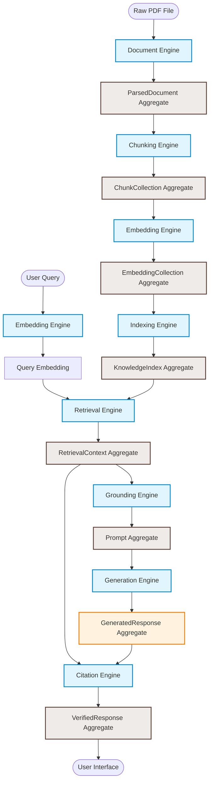

# RAG Pipeline Data Lifecycle

This document provides a single-page overview of the complete end-to-end data lifecycle of Libris.

---

## 1. End-to-End Lifecycle Flow

The processing pipeline transforms raw textbook inputs into verified, structured query answers. Every stage is managed by a dedicated Domain Engine that takes one aggregate and produces another, culminating in a final verification stage that merges two paths.

---

## 2. Stage Breakdown

### Ingestion Flow
1.  **PDF -> ParsedDocument**: The `DocumentEngine` processes the source PDF structure to produce a structured document tree of chapters, sections, and pages.
2.  **ParsedDocument -> ChunkCollection**: The `ChunkingEngine` splits text pages into semantic, overlapping chunk segments while preserving structural context.
3.  **ChunkCollection -> EmbeddingCollection**: The `EmbeddingEngine` executes vector mapping to transform text chunks into numerical vectors.
4.  **EmbeddingCollection -> KnowledgeIndex**: The `IndexingEngine` loads and stores embeddings and metadata into a persistent search index (ChromaDB).

### Query & Answer Flow
5.  **Query -> QueryEmbedding**: The `EmbeddingEngine` embeds the user's search text.
6.  **QueryEmbedding + KnowledgeIndex -> RetrievalContext**: The `RetrievalEngine` searches the index, filtering by threshold, and outputs rank-ordered context chunks.
7.  **RetrievalContext -> Prompt**: The `GroundingEngine` templates chunks and query instructions into a format optimized for the language model.
8.  **Prompt -> GeneratedResponse**: The `GenerationEngine` executes language model generation.
9.  **RetrievalContext + GeneratedResponse -> VerifiedResponse**: The `CitationEngine` reconciles source chunks against the generated answer, formatting citations and excerpts.
